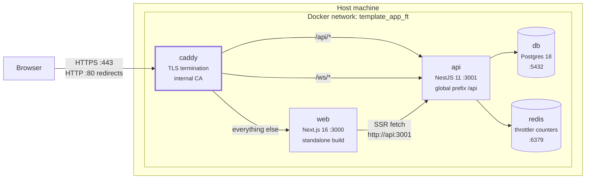
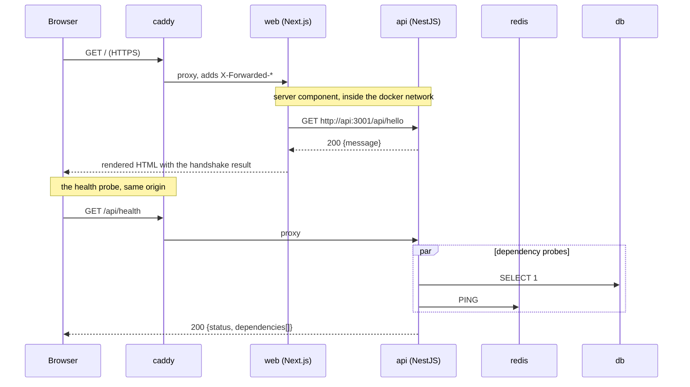
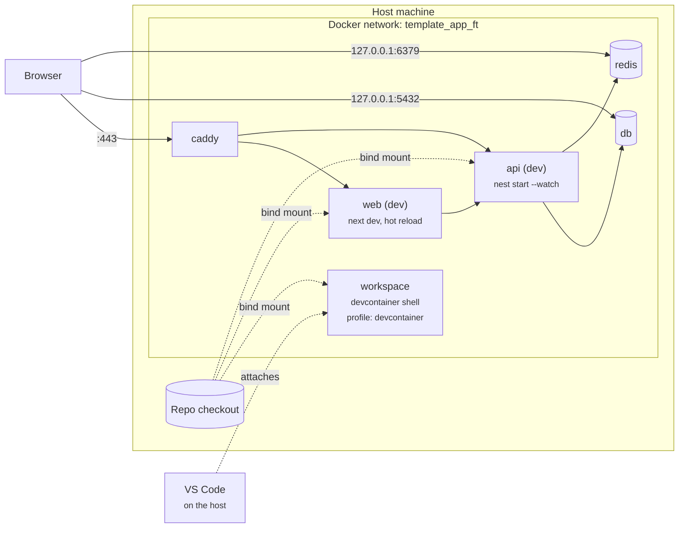
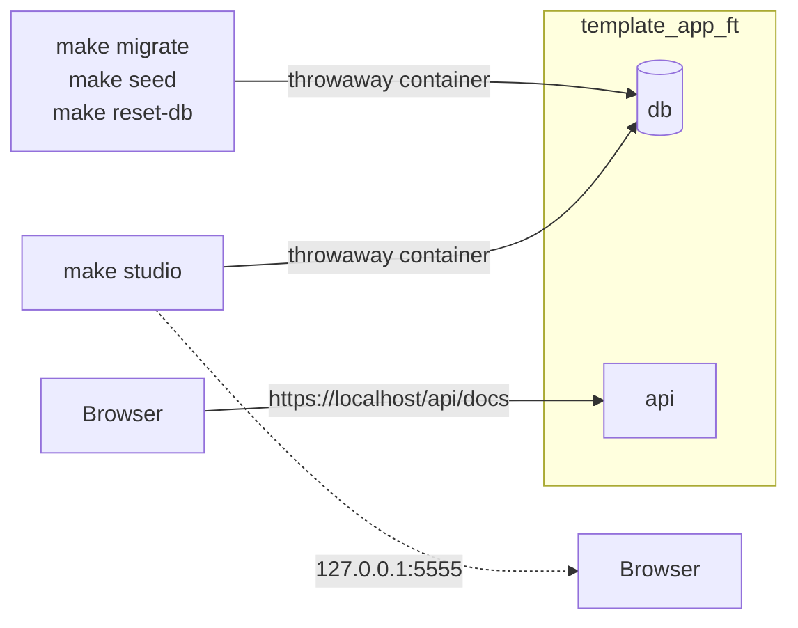
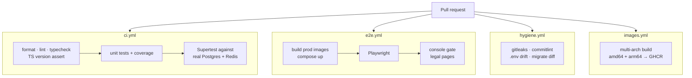
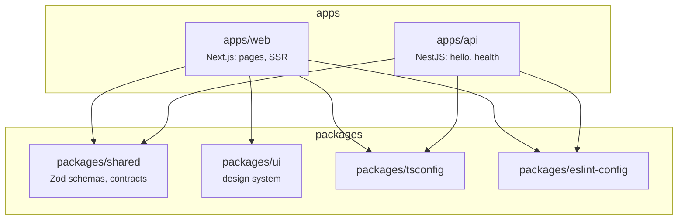

# Architecture

How the containers fit together, in production and in development.
Companion: [VERSIONS.md](VERSIONS.md) (pinned versions and why).

Every diagram below is generated from the compose files as they actually are. If
you change a port or a route, change the diagram in the same commit.

---

## 1. The rule that explains the rest

> **NestJS owns all business logic and data access. Next.js does presentation and
> SSR only.** No Prisma client in `apps/web`, no domain logic in server actions.

Next's server calls NestJS over the internal network, exactly like the browser
does, only without leaving Docker. "Which runtime owns what" has to be a
one-sentence answer, and this is it.

---

## 2. Production (`make`, `make run`, `make up`)

Files: `compose.yml` + `compose.prod.yml`. Images are built at the `prod` stage,
nothing is bind-mounted, and every service carries `restart: unless-stopped`.

**Only caddy publishes a port.** `web`, `api`, `db` and `redis` are unreachable
from outside the network: internal traffic stays plain HTTP, and TLS is
terminated once, at the edge.

| Published | Service | Purpose |
|---|---|---|
| `:80` | caddy | Redirects to HTTPS |
| `:443` tcp + udp | caddy | The only way in. udp is HTTP/3 |

Defaults; overridable per-machine via `HTTP_PORT`/`HTTPS_PORT` in `.env`
(see `.env.example`) when 80/443 are already bound by something else.

### Why one origin matters

Because `/` and `/api` are the same origin, there is no CORS configuration to
maintain, and any cookie you add later is first-party: no `SameSite=None`, and
`httpOnly` costs nothing. Routing happens in `infra/caddy/Caddyfile`:

| Path | Goes to | Note |
|---|---|---|
| `/api`, `/api/*` | `api:3001` | Prefix forwarded intact; `handle_path` would strip it and every route would 404 |
| `/ws`, `/ws/*` | `api:3001` | Reserved for WebSockets. Caddy detects the Upgrade handshake inside `reverse_proxy` |
| everything else | `web:3000` | Next.js |

---

## 3. A request through the stack

The home page handshake touches every layer that exists today, so it is the
useful one to trace.

Three details worth knowing:

- **`trust proxy` is 1, not `true`.** Caddy terminates TLS and forwards plain
  HTTP, so Express only learns the request was secure from `X-Forwarded-Proto`.
  Trusting exactly one hop means a client-supplied `X-Forwarded-For` never
  becomes `req.ip`, which is what the rate limiter counts.
- **The handshake never throws.** `fetchHello` in `apps/web/lib/api.ts` returns
  an `unavailable` result instead of rejecting, because the home page is
  server-rendered and an exception there would be a 500 on a page that still has
  something useful to show.
- **`/api/health` always answers 200**, including when a dependency is down: the
  body carries the verdict. A non-2xx would make Docker restart a container whose
  only problem is that Postgres is still starting.

---

## 4. Development (`make dev`)

Files: `compose.yml` + `compose.override.yml`, which loads automatically. Images
are built at the `dev` stage, source is bind-mounted, and both apps hot reload.

Dev publishes two more ports, both **loopback only**, so a database is never
exposed to the room:

| Published | Service |
|---|---|
| `127.0.0.1:5432` | db, for a local SQL client |
| `127.0.0.1:6379` | redis, for `redis-cli` |

### node_modules and generated output

Source is bind-mounted, but dependencies live in the image. Each `node_modules`
path is masked by a named volume, and so is anything a container writes as root:

| Masked path | Volume | Why |
|---|---|---|
| every `*/node_modules` | `api-node-modules-*`, `web-node-modules-*` | Host and container dependencies would otherwise collide |
| `apps/api/dist` | `api-dist` | `nest start --watch` compiles as root |
| `apps/api/src/generated` | `api-generated` | `prisma generate` runs as root at container start |
| `apps/web/.next` | `web-next` | Same reasoning |

Without those, a `make dev` leaves uid 0 files in the checkout and the next
`make` fails with `EACCES`.

### The devcontainer

`workspace` sits behind `profiles: [devcontainer]`, so a plain `docker compose up`
skips it while `.devcontainer/devcontainer.json` naming the service activates it.
`shutdownAction: none` is deliberate: the default would stop the whole stack when
the editor window closes.

> **Ports inside the devcontainer.** Compose publishes to the *host's* loopback,
> and the devcontainer is just another container on the network. From a terminal
> inside it, reach the stack by service name — `https://caddy/api/health`, not
> `https://localhost`. From your browser on the host, `https://localhost` is right.

---

## 5. Tools that are not services

Neither runs as part of the stack; both are throwaway containers on the same
network, built from the api `build` stage (`template_app/api-tooling`).

| Tool | Reach it at | Notes |
|---|---|---|
| **Swagger UI** | `https://localhost/api/docs` | Served by the api itself, so it arrives through Caddy on the same origin. `/api/docs-json` is the raw OpenAPI document. Signed in? The `ft.sid` cookie rides along, so "Try it out" works on guarded routes with nothing to paste. |
| **Prisma Studio** | `http://127.0.0.1:5555` after `make studio` | Loopback only: it is unauthenticated read-write access to the whole database. `STUDIO_PORT=5556` if the port is taken. Restart it after `make` or `make reset-db`, since db gets a new container and Studio keeps the old connection. |

There is no Adminer or pgAdmin service in this project; Prisma Studio is the
database browser, and it already knows the schema.

---

## 6. What CI runs

Four workflows. `ci` and `e2e` are the ones that gate a merge on behaviour.

Two of those checks only mean something on a production build, which is why they
run against production images rather than a dev server:

- **console gate** — zero console errors, warnings, uncaught exceptions or failed
  requests, on every route, including client-side navigation.
- **legal pages** — `/privacy` and `/terms` answer 200 with real content.

`make ci` runs the same checks natively, and `make` runs all of it plus the
production stack and Playwright.

---

## 7. Where the code lives

`packages/shared` is the reason validation cannot drift: a form and the endpoint
it posts to apply the *same* Zod schema, so validating on both sides is one
declaration rather than two copies that slowly disagree. The rule that keeps it
honest is that nothing secret — a password hash, a token — ever appears in a
schema there, because both runtimes import this package.
